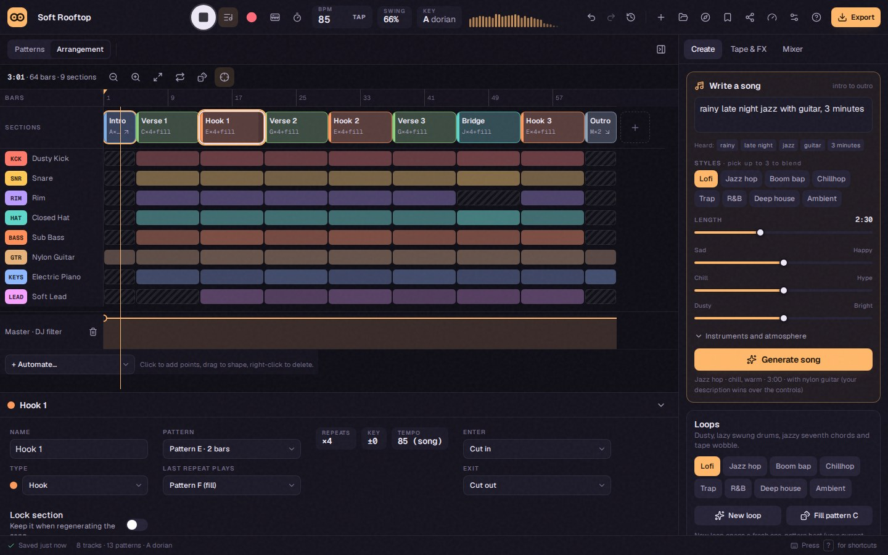

# LofiLoop

**Make full lofi songs in your browser.** Describe a song ("rainy late-night jazz with guitar, 3 minutes") and LofiLoop writes it from intro to outro, then lets you arrange, play, record and mix it. The instruments are synthesized, you can chop your own samples, and you can export a mastered WAV or MP3, stems, MIDI or a music video. There's no account and nothing is uploaded. Everything runs and saves on your device, even offline.



## Features

**Write songs**

- Song generator for lofi, jazz hop, boom bap, chillhop, trap, R&B, deep house and ambient
- Songs from 30 seconds to 6 minutes, with intros, verses, hooks, bridges, breaks and outros
- Songs include energy curves, drum fills, risers, a recurring hook motif and optional key lifts
- Blend up to three styles, set the mood (sad ↔ happy, chill ↔ hype, dusty ↔ bright) and choose instruments that must play
- Describe a song in plain words: styles, moods, tempo, key, length, instruments, ambience and things to leave out
- Regenerate one section (everything, or just drums, harmony or melody) or every unlocked section; lock the parts you like
- Discover gallery of generated songs and endless radio stations; all of it is generated on your device

**Arrange**

- Arrangement timeline: drag sections to reorder, drag an edge to change repeats, and zoom and follow the playhead
- Per-section track mutes, fill patterns for the last repeat, key and tempo changes
- Section transitions: filter sweeps, fades, drops and tape stops
- Automation lanes for master volume, tone, filter, reverb, echo and wow, and for each track's volume, pan, cutoff and sends
- Loop any range of bars while you work on it
- Up to 24 tracks, 32 patterns of up to 128 steps and 128 sections

**Sequence and play**

- Step sequencer with per-step velocity, chance, ratchets, note length and micro-timing
- Per-track feel (push/drag) and humanize
- Piano roll and drawable velocity/chance lanes; chord mode for triads, 7ths and 9ths in the key
- Play any track from your computer keyboard or a MIDI keyboard
- Record with count-in, quantize, and overdub or replace; each take is one undo step
- Performance mode: launch sections on the next bar, mute tracks, and hold filter, reverb-wash, stutter and tape-stop effects

**Sound**

- 24 synthesized instruments across drums, bass, keys, band (Wurlitzer, nylon guitar, strings, flute, choir, upright bass), synths and FX
- Sampler: drop in an audio file or record from the microphone, trim it, then play it pitched or chop it into slices (with automatic hit detection)
- Per-track effects: high/low-pass filter with resonance, drive, bit crush and chorus
- Sidechain ducking from any track
- Tape master chain: drive, crush, wow and flutter, tone, vinyl crackle, bus glue, a limiter and a safety clipper
- Atmosphere beds: rain, café, city, night, room tone and vinyl
- Live loudness meter

**Share and export**

- WAV (16/24-bit or 32-bit float), MP3, stems as a `.zip`, multi-track MIDI with tempo changes
- Loudness mastering to −14 or −10 LUFS with a −1 dBTP true-peak ceiling
- Music videos (MP4 or WebM) with five animated, audio-reactive scenes in 16:9, 1:1 or 9:16
- Generated cover art, rendered at 3000 px
- Share links that carry the whole song in the URL

**Your library**

- Everything saves automatically to IndexedDB and works offline; the app can be installed as a PWA
- Automatic and named versions, one-click restore, and A/B compare while the song plays
- Play your whole library back to back with the mini player
- History panel to jump back to any earlier step, plus undo/redo
- Guided tour, five themes and keyboard shortcuts; layouts work on phones and tablets

## Getting started

Requires Node.js 20.9+ (see `.nvmrc`).

```bash
npm install
npm run dev
```

Open http://localhost:3000.

| Script                            | What it does                                                         |
| --------------------------------- | -------------------------------------------------------------------- |
| `npm run dev`                     | Start the dev server                                                 |
| `npm run build` / `npm start`     | Production build / serve it                                          |
| `npm run lint`                    | ESLint (Next.js + TypeScript rules)                                  |
| `npm run typecheck`               | `tsc --noEmit`                                                       |
| `npm run format` / `format:check` | Prettier with the Tailwind plugin                                    |
| `npm test`                        | Unit and component tests (Vitest)                                    |
| `npm run test:e2e`                | End-to-end tests in Chromium (Playwright; run `npm run build` first) |
| `npm run check`                   | Lint, typecheck, format check and unit tests                         |

## Keyboard shortcuts

| Keys                         | Action                                              |
| ---------------------------- | --------------------------------------------------- |
| `Space`                      | Play / stop (or pause the mini player)              |
| `1`–`8`                      | Select pattern A–H                                  |
| `↑` / `↓`                    | Select track                                        |
| `M` / `S`                    | Mute / solo the selected track                      |
| `K`                          | Metronome                                           |
| `T`                          | Tap tempo                                           |
| `P`                          | Play the selected track from your computer keyboard |
| `Del`                        | Clear the selected track                            |
| `Ctrl/⌘ Z`, `Ctrl/⌘ Shift Z` | Undo, redo                                          |
| `Ctrl/⌘ C`, `Ctrl/⌘ V`       | Copy / paste a pattern                              |
| `Ctrl/⌘ D`                   | Duplicate the selected track                        |
| `Ctrl/⌘ S`, `E`, `O`         | Save now, export, open the library                  |
| `Tab` (while comparing)      | Flip between A and B                                |
| `?`                          | All shortcuts and tips                              |

In piano mode, the bottom row (`Z`–`/`) and top row (`Q`–`]`) play two octaves. `←`/`→` change the octave, `Shift` accents a note, and `Esc` leaves piano mode.

## How it works

```
src/
├── app/                  Next.js App Router shell, metadata, manifest, PWA icons, error pages
├── components/
│   ├── studio/           Top bar, sequencer, inspector, side panels, keyboard, tour, performance mode
│   ├── song/             Arrangement timeline, section lane, mute matrix, automation lanes
│   ├── listen/           Mini player and A/B compare bar
│   ├── dialogs/          Export (audio, video, cover), library, versions, Discover, new beat, share
│   └── ui/               Accessible primitives: Knob, Fader, Dialog, Popover, Menu…
├── hooks/                Hotkeys, playhead subscription, level meters
└── lib/
    ├── audio/
    │   ├── engine.ts     Realtime playback: worker-timed lookahead scheduler, seek, live effects
    │   ├── sequence.ts   Pure song timeline and step → note-event logic shared by playback and export
    │   ├── performer.ts  Turns steps into sound: events, ducking, automation and transitions
    │   ├── mixer.ts      Track strips with insert effects, sends, ambience and the master tape chain
    │   ├── render.ts     Offline rendering of the mix or stems
    │   └── instruments/  The synthesized voices and the sampler
    ├── generate/         Song structure, motifs, grooves, the prompt parser and pattern tools
    ├── input/            Computer-keyboard piano, Web MIDI and the take recorder
    ├── storage/          IndexedDB library: projects, versions, samples, bundles
    ├── visual/           Cover art, animated scenes and audio analysis for videos
    ├── export/           WAV, MP3, MIDI, ZIP, loudness (BS.1770) and mastering, video (WebCodecs)
    ├── music/            Scales, chords, seeded RNG
    ├── project/          Types, factories, file format (zod, v3 with v2 migration), share links, templates
    └── store/            Zustand + Immer project store with labelled history, UI state
```

- **One engine for playback and export.** Live playback and offline rendering build the same mixer and drive it through the same performer, so exports (and videos) match what you hear, down to transitions and automation.
- **Timing.** A lookahead scheduler, ticked from a Web Worker so it keeps time in background tabs, schedules notes about 120 ms ahead on the audio clock. It reads the latest project state on every tick, so edits are heard straight away. The playhead follows the audio clock, corrected for output latency.
- **Songs are data.** A song is an arrangement of sections that point at patterns, plus automation lanes measured in bars. The generator only writes that data, so everything it makes can be edited.
- **State.** Every edit goes through one `update()` that uses Immer. Structural sharing keeps undo snapshots cheap, and every entry is labelled for the history panel.
- **Storage.** Projects, versions and samples live in IndexedDB; preferences stay in `localStorage`. If the tab closes mid-save, a synchronous backup is restored on the next start. A service worker caches the app shell so it opens offline.
- **Privacy.** There's no backend. Share links carry the song in the URL fragment, which is never sent to a server.

## Browser support

Recent Chrome, Edge, Firefox and Safari (desktop and mobile).

- Share links need `CompressionStream`.
- Video export needs WebCodecs. MP4 needs H.264 and AAC, otherwise LofiLoop writes WebM.
- MIDI input needs Web MIDI (Chrome and Edge).
- On iOS, turn off silent mode to hear audio.

## License

[GPL-3.0](LICENSE)
